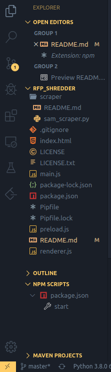

RFP_Shredder
===============================================================================

Highlight Search Terms and Analyze Request For Proposals (RFPs)

Contents
-------------------------------------------------------------------------------

- [RFP_Shredder](#rfpshredder)
  - [Contents](#contents)
  - [Project Success and End Goal](#project-success-and-end-goal)
  - [Unknowns](#unknowns)
  - [Gallery](#gallery)
  - [Features](#features)
  - [Usage](#usage)
    - [Windows](#windows)
      - [Stuff to Install](#stuff-to-install)
      - [Stuff To Do](#stuff-to-do)
    - [MacOS](#macos)
      - [Stuff to Install](#stuff-to-install-1)
      - [Stuff to Do](#stuff-to-do-1)
  - [TODO List](#todo-list)
    - [Backlog](#backlog)
    - [Weekly Sprints](#weekly-sprints)

Project Success and End Goal
-------------------------------------------------------------------------------

The situation provided by TeraThink is that internally the company reviews incoming Requests for Proposals (RFPs) and then drafts their response to the proposal all by-hand.  TeraThink is looking to have our team optimize this process primarily by creating a tool that automates the initial reviewing process.  The first step is that an RFP is received in the PDF format and must be accurately converted to a word document.  Next, the RFP is “shredded” meaning the document is parsed and is modified to highlight and bold all instances of pre-specified keywords.  After this initial review process is completed, TeraThink can begin developing their response using the key highlighted words as a guide to drafting a response.

The minimum viable product for this project will include an appealing front end to an application that takes PDFs or Word Documents (.docx) as an input and outputs a processed docx. The output docx has highlighted and capitalized key search words provided; TeraThink thinks that the words shall, must, will, etc. are important and wants those to stand out in a document. This should be done with an emphasis on maintaining the same page numbers and formatting as the original file. This project will automate TeraThink’s initial RFP review process and therefore optimize their internal productivity.

Unknowns
-------------------------------------------------------------------------------

We currently don’t know:

1. How to programmatically convert a to PDF to Docx
2. How to analyze RFPs for important task/requirements
    a. Highlighting, capitalizing, maintaining page numbers and formatting
3. How to estimate if a Response addresses every demand of an RFP
4. Unsure how the scalability of our project will impact TeraThink
5. Potential Deadlines
6. Potential Hardware/Software Limitations at TeraThink
7. What platform should we base our application on
8. Should we use UI Path and (RPA) Robotic Process Automation
9. Unsure of how to measure the accuracy of our project
    a. Unsure of what additional features TeraThink will require to put an RFP processing application in action
10. Unsure if we have access to Adobe licenses

Gallery
-------------------------------------------------------------------------------


Features
-------------------------------------------------------------------------------

Usage
-------------------------------------------------------------------------------

### Windows

#### Stuff to Install

1. [Node.js](https://nodejs.org/en/download/)
   1. I have the 'Current' versions installed on Ubuntu, but which version you install here won't really matter.
2. [WSL](https://docs.microsoft.com/en-us/windows/wsl/install-win10)
   1. __WARNING:__ I haven't been able to get electron to run in WSL, yet. It seems like WSL doesn't support GUI applications, and electron needs a version of chromium to run. But, installing the WSL is still the Windows recommended way to develop Node.js on Windows.
   2. Dr. Brown's Lab actually has some [Bash tutorials](https://docs.google.com/document/d/1RamTOnZqMghshHrruyBtOo_gDqxQ8DrCzV1SlGbCDJQ/edit) if you're unfamiliar with a command line. Skip the setting up a Linux VM, and try using VS Code to connect to the WSL. In VS Code, you can pull up a terminal (type CTRL+` (Right next to the '1')). Let me know what you think of the tutorial if you try it out, so I can give feedback.
   3. When picking your version of linux to install, I'd pick Ubuntu.
3. [Visual Studio Code](https://code.visualstudio.com/Download)
   1. [How to install extensions in VS Code](https://code.visualstudio.com/docs/editor/extension-gallery)
   2. Recommended Plugins for Node + Python development
      1. Python by Microsoft
      2. Prettier by Esben Petersen
      3. ESLint by Dirk Baeumer
      4. WSL extension by Microsoft (I forgot the exact name)
      5. NPM by egamma

#### Stuff To Do

1. Cloning the repo
   1. With VS Code connected to the WSL, pull up a terminal
   2. Commands:

```bash
cd # Change directory to home
git clone https://github.com/Curt-iss/rfp_shredder # Clone our repo
cd rfp_shredder
```

1. Congrats, you're stuck at the same point as me.
   1. I think the next thing to do is symlink to the node.js executable you installed. Instructions coming when I figure it out.

### MacOS

I honestly don't have a Mac, so I'm not 100% sure. These are more general Unix steps to follow.

#### Stuff to Install

1. [Homebrew](https://brew.sh/)
2. Node.js
    1. If you installed Homebrew, open a terminal and enter: `brew install node`
    2. If you didn't install Homebrew, [nodejs.org](https://nodejs.org/en/download/) 
3. [Visual Studio Code](https://code.visualstudio.com/Download)
   1. [How to install extensions in VS Code](https://code.visualstudio.com/docs/editor/extension-gallery)
   2. One time, I heard VS Code is already installed on MacOS?
   3. Recommended Plugins for Node + Python development
      1. Python by Microsoft
      2. Prettier by Esben Petersen
      3. ESLint by Dirk Baeumer
      4. NPM by egamma

#### Stuff to Do

1. Brush up on Bash, if you're unfamiliar
    1. Dr. Brown's Lab actually has some [Bash tutorials](https://docs.google.com/document/d/1RamTOnZqMghshHrruyBtOo_gDqxQ8DrCzV1SlGbCDJQ/edit) if you're unfamiliar with a command line. Skip the setting up a Linux VM. In VS Code, you can pull up a terminal (type CTRL+` (Right next to the '1')). Let me know what you think of the tutorial if you try it out, so I can give feedback.
2. Cloning the repo
   1. With VS Code open, pull up a terminal
   2. Commands:

```bash
  cd # Change directory to home, maybe change to a directory where you
     # always put your school work?
  git clone https://github.com/Curt-iss/rfp_shredder # Clone our repo
  cd rfp_shredder
```

1. Starting Electron
   1. Theoretically, `npm` and `node` got installed together, so this should work
   2. In a terminal enter: `npm i && npm start`
      1. Did a pretty box open up?
   3. Alternatively, if you install the npm plugin, you should be able to see npm scripts in the bottom left. You can click 'start' to (hopefully) start electron.



TODO List
-------------------------------------------------------------------------------

### Backlog

1. Learn how to exchange work with GitHub
2. Propose electron to TeraThink contacts
    a. Completed - Demonstrated at 2-6 meeting
3. Figure out File upload to electron
4. Figure out how to export a file from the application
5. Packaging application and distribution
6. PDF conversion software
7. Annotate RFP document
    a. Search for keywords
    b. Highlight and capitalize words
    c. Maintain page numbers

### Weekly Sprints

Sprint 1: File upload

Sprint 2: Conversion to text file

Sprint 3: RFP keyword search, highlight, capitalization (maintain page numbers

Sprint 4: Exporting and cleaning up final project
